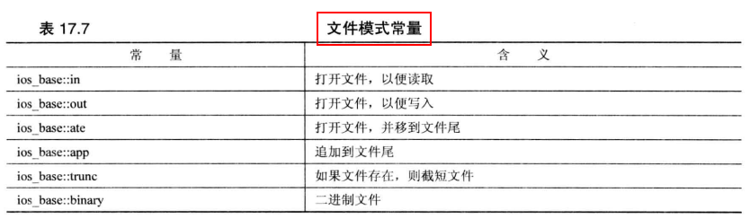
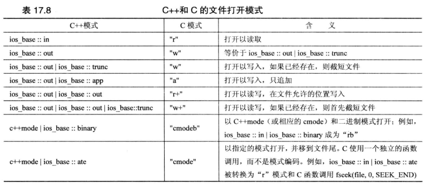

0.1. 《c++ 学习笔记》
----------------------------------------------

- [1. c](#1-c)
  - [1.1. c与c++的不同点](#11-c与c的不同点)
  - [1.2. 命令行参数传递，或者说main函数参数](#12-命令行参数传递或者说main函数参数)
- [2. 面向对象的C++](#2-面向对象的c)
  - [2.1. 文件模式](#21-文件模式)
- [3. c++模板 TODO](#3-c模板-todo)
- [4. 标准模板库STL TODO](#4-标准模板库stl-todo)

# 1. c

## 1.1. c与c++的不同点
[doc](./从C到C++.md)

## 1.2. 命令行参数传递，或者说main函数参数
[doc](./code/003%20cmd%20parameters.cc)

# 2. 面向对象的C++

## 2.1. 文件模式

 

# 3. c++模板 TODO

# 4. 标准模板库STL TODO