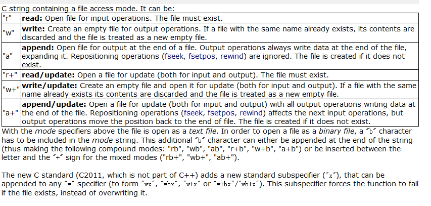

# 文件IO

工作上经常需要将计算数据保存到文件中以便分析，或者从文件中读入原始数据来进行计算。特此总结一下常用的文件IO场景，并分别用c,c++,python来实现。

文件读写的过程可以分解为三步，首先打开或者创建文件（资源），然后对文件进行读写，最后再释放文件。

## file io ref
[c file io ref](http://www.cplusplus.com/reference/cstdio/)

[c++ file io ref](http://www.cplusplus.com/reference/fstream/) 

[python io ref](https://docs.python.org/3/library/io.html)

## 文件模式

任何编程语言提供的文件IO接口都是对操作系统IO的封装，都需要指明**文件模式**，比如是从
文件读还是往文件写等，读写的是字符串还是二进制等。

首先应该区分是`二进制`模式，还是`字符串`模式。因为通常读写字符串和二进制是不同的函数，但打开文件和关闭文件的操作都一致。


### c的文件模式

文件模式很多，个人理解主要把握住是`读r`、`写w`、还是`追加a`，如果是二进制读写记得加上`b`。用到最多的还是`w`。todo:`w vs w+` 那个`+`的含义是什么？

[ref](http://www.cplusplus.com/reference/cstdio/fopen/)


### python的文件模式
个人理解python的文件模式是参考c的设计，与c完全一致。相比之下cpp的文件模式显得诡异又难以记忆。

[ref](https://www.runoob.com/python/python-files-io.html)


## 文件IO——读写字符串

### c
文件IO相关的函数主要是`fopen` `fclose` `fprintf` `fputs` `fgets`

```c
/* 从文件读入字符串  fgets example */
#include <stdio.h>

int main()
{
   FILE * pFile;
   char mystring [100];

   pFile = fopen ("myfile.txt" , "r");
   if (pFile == NULL) perror ("Error opening file");
   else {
     // fgets从文件中读取字符串  
     if ( fgets (mystring , 100 , pFile) != NULL )
       puts (mystring);
     fclose (pFile);
   }
   return 0;
}
```

```c
/* 字符串写入文件 example */
#include <stdio.h> //file IO 相关的函数都在里面
int main ()
{
  FILE *pFile = fopen ("myfile.txt","w");//以写模式打开文件，返回文件句柄
  if (pFile!=NULL)
  {
    fputs ("fopen example",pFile);
    fprintf(pFile,"format a string%d", 100);//格式化字符串

    fclose (pFile);//最后关闭文件句柄
  }
  return 0;
}
```

### python

python的文件读写就显得简洁容易理解。

```py
# 写字符串
with open("test.txt", 'w', encoding='utf-8') as f:
    f.write("my first file\n")
    f.write("add a new line\n")
    
# 读字符串
with open("test.txt", 'r', encoding='utf-8') as f:
    for line in f:
        print(line)
```

## 文件IO——读写二进制

### c
```c
/* 写二进制文件 fwrite example : write buffer */
#include <stdio.h>

int main ()
{
  FILE * pFile;
  char buffer[] = { 'x' , 'y' , 'z' };
  pFile = fopen ("myfile.bin", "wb");
  fwrite (buffer , sizeof(char), sizeof(buffer), pFile);
  fclose (pFile);
  return 0;
}
```

```c
/* 读二进制 fread example: read an entire file */
#include <stdio.h>
#include <stdlib.h>

int main () {
  FILE * pFile;
  long lSize;
  char * buffer;
  size_t result;

  pFile = fopen ( "myfile.bin" , "rb" );
  if (pFile==NULL) {fputs ("File error",stderr); exit (1);}

  // obtain file size:
  fseek (pFile , 0 , SEEK_END);
  lSize = ftell (pFile);
  rewind (pFile);

  // allocate memory to contain the whole file:
  buffer = (char*) malloc (sizeof(char)*lSize);
  if (buffer == NULL) {fputs ("Memory error",stderr); exit (2);}

  // copy the file into the buffer:
  result = fread (buffer,1,lSize,pFile);
  if (result != lSize) {fputs ("Reading error",stderr); exit (3);}

  /* the whole file is now loaded in the memory buffer. */

  // terminate
  fclose (pFile);
  free (buffer);
  return 0;
}
```
### todo:python
