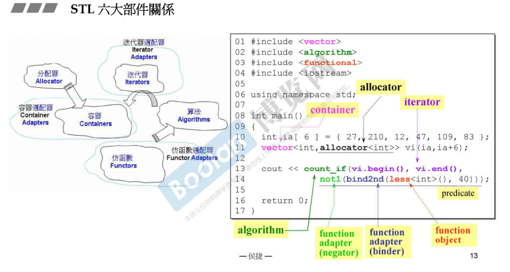

## 概述

`源码之前，了无秘密`

**level 0** 使用C++标准库
**level 1** 认识C++标准库
**level 2** 良好使用C++标准库
**level 3** 扩充C++标准库

**重要的网站**
[cpp reference有中文版](https://en.cppreference.com/w/)
[cpulsplus](http://www.cplusplus.com/)
[gcc官网](https://gcc.gnu.org/onlinedocs/)

**stl 六个组成部分**

1. 容器 containers————就是各种数据结构的实现
2. 迭代器 iterators————特点是前闭后开[)
3. 分配器 allocators————用于管理内存
4. 算法 algorithms————主要由函数模板实现
5. 适配器 adapters————就是包装一下其它东西
6. 仿函数 functors————个人理解就是各种函数对象，作为参数传给算法模块

## vector
内存扩展时按两倍大小新申请一块新内存，然后把旧的数据拷贝，所以影响速度

## allocator
不建议直接使用allocator，大意是因为释放内存的时候还要指定大小，显得很麻烦

## 
