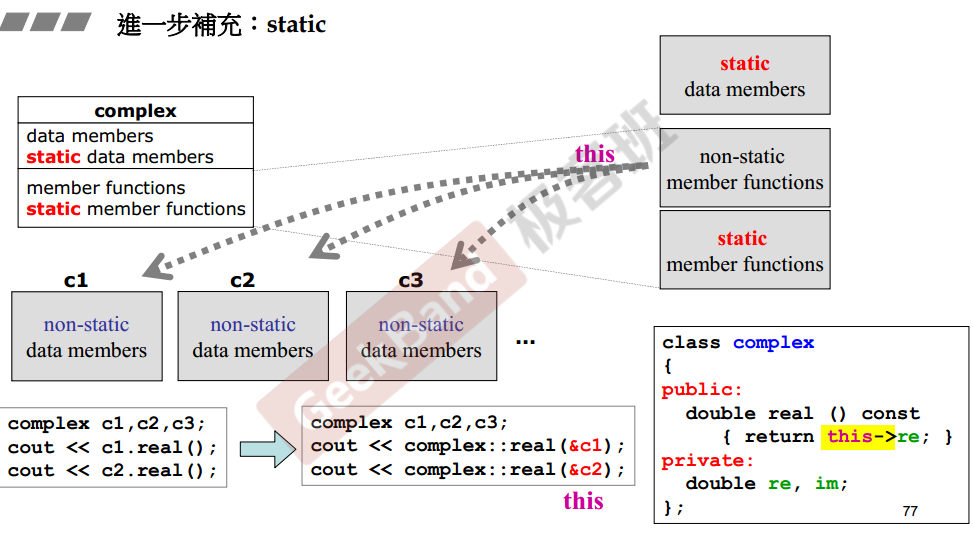
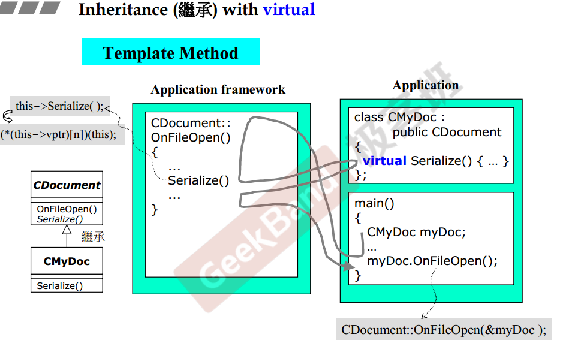
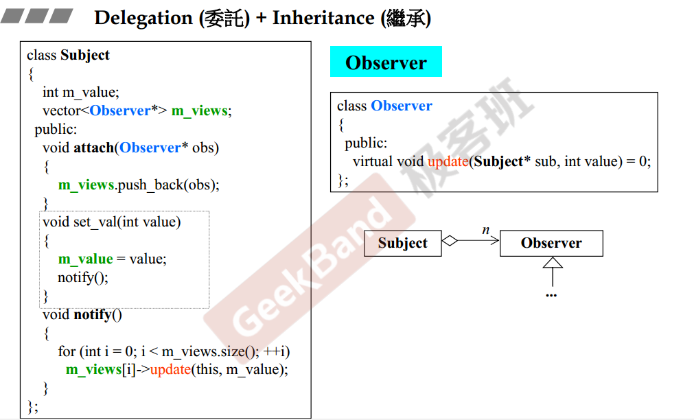
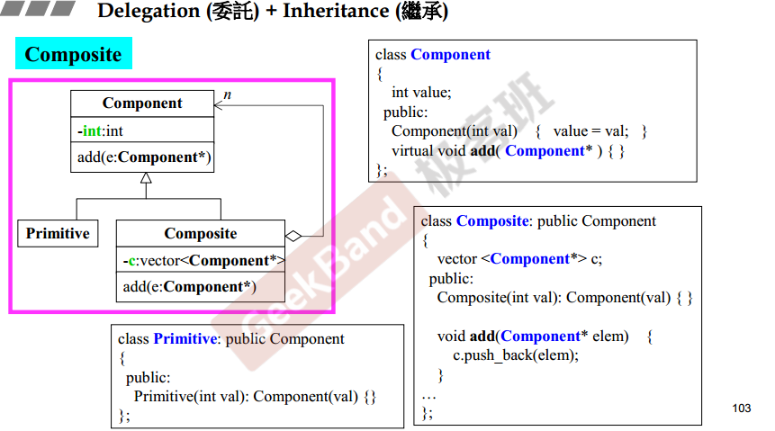
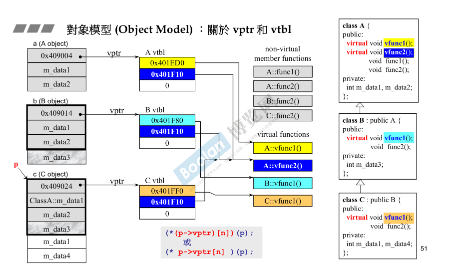
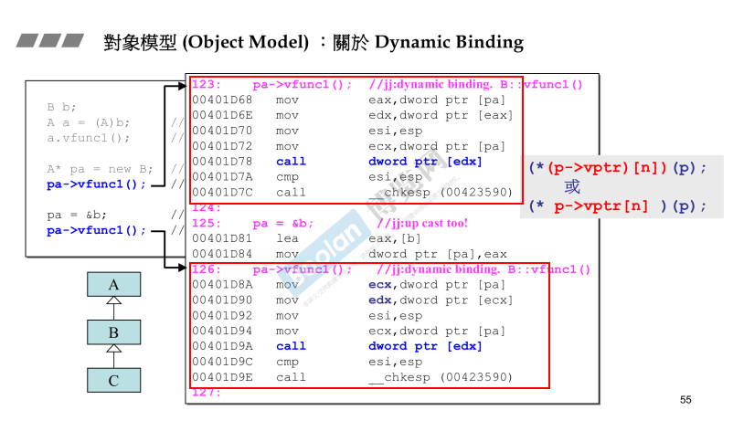

- [Object Based 基于对象:单一class的设计](#object-based-基于对象单一class的设计)
  - [class without pointer member](#class-without-pointer-member)
  - [constructor(ctor，构造函数)](#constructorctor构造函数)
    - [initializaton list（初始化列表）](#initializaton-list初始化列表)
    - [23个设计模式之——singleton(单件)](#23个设计模式之singleton单件)
    - [默认构造函数](#默认构造函数)
    - [const](#const)
    - [`pass by value` VS `pass by reference(to const)`](#pass-by-value-vs-pass-by-referenceto-const)
    - [`return by value` VS `return by reference(to const)`](#return-by-value-vs-return-by-referenceto-const)
    - [friend(友元)](#friend友元)
    - [移动构造](#移动构造)
    - [operaor overloading(运算符重载)](#operaor-overloading运算符重载)
    - [临时对象 temp object](#临时对象-temp-object)
  - [class with pointer member](#class-with-pointer-member)
    - [big three 三个特殊函数——针对有指针成员的class](#big-three-三个特殊函数针对有指针成员的class)
    - [类中的static成员](#类中的static成员)
    - [动态内存分配](#动态内存分配)
  - [namespace命令空间](#namespace命令空间)
- [Object oriented 面向对象：多个class的设计，要考虑class之间的关系](#object-oriented-面向对象多个class的设计要考虑class之间的关系)
  - [对象之间的三种基本关系](#对象之间的三种基本关系)
  - [composition组合——表示has-a关系](#composition组合表示has-a关系)
    - [23个设计模式之——adapter](#23个设计模式之adapter)
  - [composition关系下的构造和析构](#composition关系下的构造和析构)
  - [delegation委托——composition by reference](#delegation委托composition-by-reference)
    - [23个设计模式之——handle/body, pImpl(pointer to implementation)](#23个设计模式之handlebody-pimplpointer-to-implementation)
  - [inheritance继承——表示is-a关系](#inheritance继承表示is-a关系)
    - [关键字——overwrite](#关键字overwrite)
    - [继承关系下的构造和析构顺序与组合关系一致](#继承关系下的构造和析构顺序与组合关系一致)
    - [inheritance with virtual funcion](#inheritance-with-virtual-funcion)
    - [23个设计模式之——Template Method](#23个设计模式之template-method)
    - [23个设计模式之——Observer观察者模式](#23个设计模式之observer观察者模式)
    - [23个设计模式之——composite](#23个设计模式之composite)
    - [23个设计模式之——prototype](#23个设计模式之prototype)
- [面向对象part 2](#面向对象part-2)
  - [conversion function 转换函数——通过成员函数转到其它类型](#conversion-function-转换函数通过成员函数转到其它类型)
  - [non-explict-one-argument ctor](#non-explict-one-argument-ctor)
  - [pointer-like class 关于智能指针](#pointer-like-class-关于智能指针)
  - [function-like class 仿函数](#function-like-class-仿函数)
  - [对象模型 object model](#对象模型-object-model)
    - [对象模型之——关于vptr和vtbl](#对象模型之关于vptr和vtbl)
    - [对象模型之——关于动态绑定dynamic binding](#对象模型之关于动态绑定dynamic-binding)

**标准库不只是学会如何调用，还可以帮助学习语法**

# Object Based 基于对象:单一class的设计

## class without pointer member
以class complex为例 [](./侯捷%20C++%20%20面向对象上/complex.h)

## constructor(ctor，构造函数)
**构造函数是什么？**
构造函数是类的特殊成员函数，目的是为**初始化**对象的**数据成员**。

**构造函数 VS 普通函数**
- 函数名字——构造函数的名字与类的名字相同
- 返回值——构造函数没有返回值
- 何时调用——有对象被创建的时候，自动调用构造函数
- 默认生成构造函数——如果不指定，则编译器会生成一个空的默认构造函数

### initializaton list（初始化列表）
默认构造函数调用时，首先调用各成员的默认构造函数，然后调用赋值构造再赋一次值。初始化列表直接使用copy constructor来初始化成员，效率更高。

**使用默认构造函数初始化 data member**
```cpp
class complex
{
public:
  complex (double r = 0, double i = 0)
  {
    re = r;
    im = i;
  }
private:
  double re, im;
}
```

**使用initiallization list初始化 data member**
```cpp
class complex
{
public:
  complex (double r = 0, double i = 0): re (r), im (i) { }
private:
  double re, im;
}
```
### 23个设计模式之——singleton(单件)
设计为singleton的class，只有static数据成员，因此所有class共享一份static data member。
特征构造函数为私有。

```cpp
class A{
  public:
    static A& getInstance();
    setup();
  
  private:
    A();//构造函数是私有
}

A& A::getInstance(){
  static A a; //class A只能创建一个实例，只能通过getInstance来获取static member
  return a;
}
```
### 默认构造函数
默认构造函数是无参构造函数`class_name()`，如果所有参数都带默认值也可作为默认构造函数`class_name(parm1=default1)`

### const
设计类时，能加const的地方尽可能都加上。函数参数，返回值，成员函数加const防止修改private成员
### `pass by value` VS `pass by reference(to const)`
设计类时，优先考虑通过reference传递参数

### `return by value` VS `return by reference(to const)` 
设计类时，优先考虑通过返回reference。因为，返回引用时不限制接受者的类型，接收者既可以是指针类型，也可是引用类型，或者直接就是value类型。

### friend(友元)
**class的友元函数可以访问私有成员**
```cpp
class complex
{
public:
  complex (double r = 0, double i = 0): re (r), im (i) { }
private:
  double re, im;

  // class的友元函数可以访问私有成员
  friend complex& __doapl (complex *, const complex&);
};

// __doapl函数是class complex的友元，所以可访问complex的私有成员
inline complex&
__doapl (complex* ths, const complex& r)
{
  ths->re += r.re;
  ths->im += r.im;
  return *ths;
}
```

**相同class的各个object互为友元**
```cpp
class complex
{
public:
  complex (double r = 0, double i = 0): re (r), im (i) { }

  // param也是class complex，所以func中可以直接范围param的私有成员
  int func(const complex& param)
  {
    return param.re + param>im;
  }

private:
  double re, im;
};
```

### 移动构造

`右值引用`就是必须绑定到右值的引用，左值的引用用&，而右值的引用则用&&。右值引用有一个重要的性质，即**只能绑定到一个将要销毁的对象**。

通俗地说，右值通常为临时变量，字面值，未接受的返回值等等，它们没有固定地址。
```cpp
int x = 30;
int &r = x;  //正确，左值引用
int &&r = x; //错误，x为左值，&&r为右值引用
int &&r = 3; //正确，右值引用
const int &r = 3;  //正确，const左值可以对右值引用
```
### operaor overloading(运算符重载)
运算符重载可设计为成员函数(有this指针)或是全局函数，具体实现要具体看

```cpp
class complex
{
public:
  complex (double r = 0, double i = 0): re (r), im (i) { }
  complex& operator += (const complex&);
private:
  double re, im;

  friend complex& __doapl (complex *, const complex&);
};

// 设计为全局函数形式 
inline complex& //返回值设计为引用，目的是可以如下调用c1+=c2+=c3
__doapl (complex* ths, const complex& r)
{
  ths->re += r.re;
  ths->im += r.im;
  return *ths;
}

// 设计为成员函数形式 
inline complex&
complex::operator += (const complex& r) // 
{
  return __doapl (this, r);
}
```

**流运算符`<<`重载的示例**

cout可以直接输出基本类型，而不用像printf一样需要指定类型,原因就是标准库中ostream类，对基本类型都重载过运算符<<

```cpp
ostream&
operator << (ostream& os, const complex& x)
{
  return os<<'('<<real(x)<<','<<imag(x)<<')';
}
```

### 临时对象 temp object
函数返回值可以返回匿名的临时对象，语法`return typename();`

```cpp
inline complex
operator - (const complex& x)
{
  return complex (-real (x), -imag (x)); //返回一个临时对象
}
```
## class with pointer member
以class string为例

### big three 三个特殊函数——针对有指针成员的class
拷贝构造cp ctor、拷贝赋值cp op=、 析构函数

```cpp
class String
{
public:                                 
   String(const char* cstr=0);                     
   String(const String& str);// 拷贝构造                   
   String& operator=(const String& str);// 拷贝赋值         
   ~String();// 析构函数                                    
   char* get_c_str() const { return m_data; }
private:
   char* m_data;// 指针成员
};

inline
String::~String()// 析构函数不能用编译器提供的默认析构函数
{
   delete[] m_data;
}

inline
String& String::operator=(const String& str)// 拷贝赋值注意形参和返回值
{
   if (this == &str) //防止对同一对象赋值，导致误删m_data指向内容
      return *this;

   delete[] m_data;
   m_data = new char[ strlen(str.m_data) + 1 ];
   strcpy(m_data, str.m_data);
   return *this;
}

inline
String::String(const String& str)// 拷贝构造
{
   m_data = new char[ strlen(str.m_data) + 1 ];
   strcpy(m_data, str.m_data);
}
```
个人理解：如果类中包含指针成员，则在构造函数中动态申请内存，统一在析构函数中释放内存。

### 类中的static成员
**内存角度看static成员**
按照是否为static，类中的成员可以分为4类。从内存分配的角度看，这4类中只有non-static data member是每个类的实例所各自拥有的，其余都是所有实例共享一份。



static member function没有this指针，所以只能处理static data member。
调用non-static member function时，必须通过this指针来传递是在处理哪个对象的数据

**static member function的调用**
方法1：className::static_function()
方法2：objectName.static_function()

**static data member需要在class body内声明，class body外定义**

### 动态内存分配

`new`:先调用malloc分配内存，再调用构造函数ctor
`delete`:先调用析造函数dtor，后调用free释放内存

## namespace命令空间
标准库都在 namespace std。
个人理解命名空间就是在全局的作用域与函数的局部作用域间又多了一层。实现起来难度不大


# Object oriented 面向对象：多个class的设计，要考虑class之间的关系

## 对象之间的三种基本关系
组合、继承、委托

## composition组合——表示has-a关系

### 23个设计模式之——adapter
class container 拥有一个成员class component,并且class container的所有功能都是通过调用class component中的方法，则称这种手法叫`adapter`

## composition关系下的构造和析构
`构造是从内到外`，先构造成员component再构造container
`析构是从外到内`，与构造顺序相反

## delegation委托——composition by reference
Delegation与composition区别只是，需要通过指针的方式引用class component

### 23个设计模式之——handle/body, pImpl(pointer to implementation)
todo:reference counting

## inheritance继承——表示is-a关系
**继承的理解** 派生类除了继承基类的data member，也会继承基类member function的调用权

### 关键字——overwrite
只用在继承关系中，派生类overwrite基类的member function

### 继承关系下的构造和析构顺序与组合关系一致
注意：base class的析构函数必须是virtual,否则会导致未定义的行为

### inheritance with virtual funcion
`non-virtual function` 表明**不**希望被派生类overwrite
`virtual function` 表明应该被派生类overwrite,基类中需要提供虚函数的定义
`pure virtual function` 纯虚函数表示一定要被派生类实现，基类中一般没有纯虚函数的定义

```cpp
// base class
class Shape{
public:
  virtual void draw() const = 0;// pure virtual 
  virtual void error(const std::string& msg);// virtual 
  int objectID() const;// non-virtual function
}

//derived class
class Rectangle:public Shape{...}
```

### 23个设计模式之——Template Method
基类把不能确定的函数声明为虚函数，派生类继承后再提供虚函数的实现。



### 23个设计模式之——Observer观察者模式
适合用在同一组数据，通过不同试图来显示。比如excel中的原始数据，可以画不同的图来显示。


### 23个设计模式之——composite
比如文件系统，文件夹下面可以有文件，也可以有文件夹。

UML图片看着奇怪

### 23个设计模式之——prototype
todo:没看懂

# 面向对象part 2

## conversion function 转换函数——通过成员函数转到其它类型

```cpp
class Fraction
{
  public:
    Fraction(int num, int den=1): m_numerator(num), m_denominator(den) {}

    // 转换函数 ，注意函数签名：没有返回值，opetator关键字 ，无参，const修饰
    operator double() const
    {
      return (double)(m_numertator / mdenominator);
    }

    private:
      int m_numertator;
      int mdenominator;
};

Fraction f(3,5)
double d=4+f;
```
## non-explict-one-argument ctor
将一种类型转换为class

convertion function 与non-explict-one-argument共存，会导致二义性。所以加explict修饰

```cpp
class Fraction
{
  public:
    //two parameters(形参), one argument(实参)
    Fraction(int num, int den=1): m_numerator(num), m_denominator(den) {}
   
    private:
      int m_numertator;
      int mdenominator;
};
```

## pointer-like class 关于智能指针
智能指针包含一个指针的数据成员，再重载一下引用运算符运算符。
```cpp
template<class T>
class shared_ptr
{
  public:
    // 固定写法
    T& operator*() const
      { return *px; }
    
    // 固定写法
    T* operator->() const
      { return px; }

    shared_ptr(T* p) : px(p) {}

  private:
    T* px;//一定包含一个指针
    long* pn;
};

shared_ptr<Foo> sp(new Foo());
Foo f(*sp);

sp->
```


## function-like class 仿函数
通过成员函数重载了小括号(),即包含member function`operaor ()`

```cpp
class identity{
  const T& operator() (const T& x) const {return x;}
}
```

## 对象模型 object model

### 对象模型之——关于vptr和vtbl

派生类对象中会包含基类的数据成员，并且派生类对象拥有基类成员函数的调用权。上图可见，对象的内存模型中除了数据成员还包括一个**虚指针vptr**，所以sizeof(a) = sizeof(a.m_data1)+sizeof(a.m_data2)+sizeof(vptr)

**虚函数的两种用法**
- 设计模式之——template method
- 多态

### 对象模型之——关于动态绑定dynamic binding

如果派生类对象调用基类中的**非虚函数**,编译时就和普通函数调用一样，就可以直接用call指令跳转到函数首地址。

pa->vfunc1() #通过指针形式调用虚函数
  (*(p->vptr[n])(p)) #等效的c形式调用

如果派生类对象调用基类中的**虚函数**,编译时通过虚指针来跳转到虚函数首地址。所以区别跳转到基类的虚函数还是派生类的虚函数，取决于对象是基类函数派生类。派生类的对象通过虚指针只能跳到overwrite后的虚函数，反之基类对象通过虚指针跳转到基类的虚函数。

**实现动态绑定的三个条件**
1. 形式是通过指针调用p->vfunc(),通过成员运算符不可以，比如object.vfunc()
2. 指针经过upcast,没有向上转型为什么不行呢？
3. 调用的虚函数

一句话就是